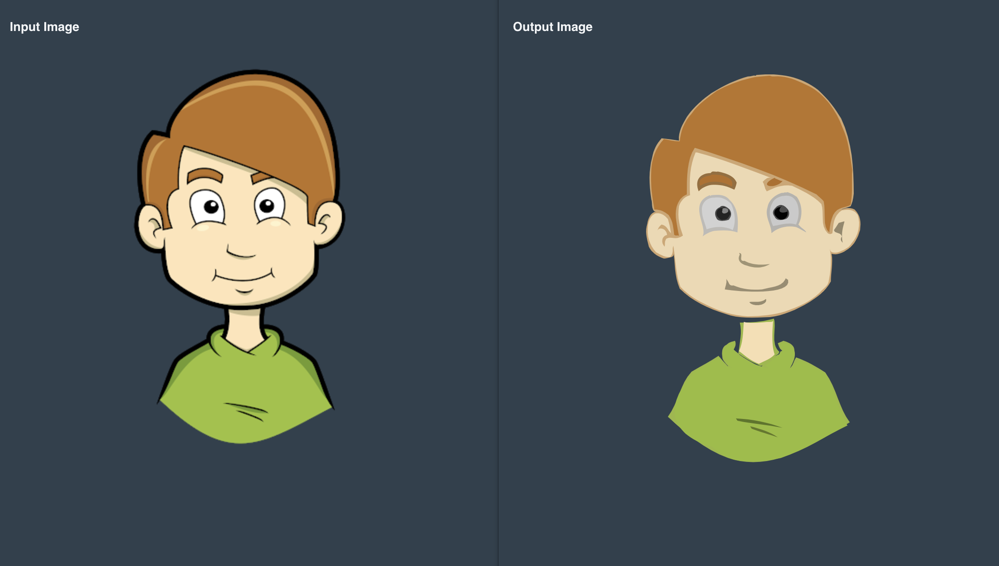
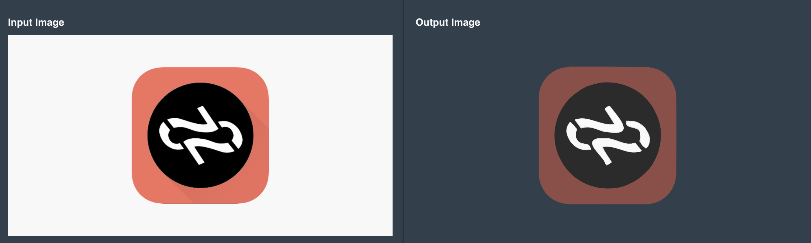
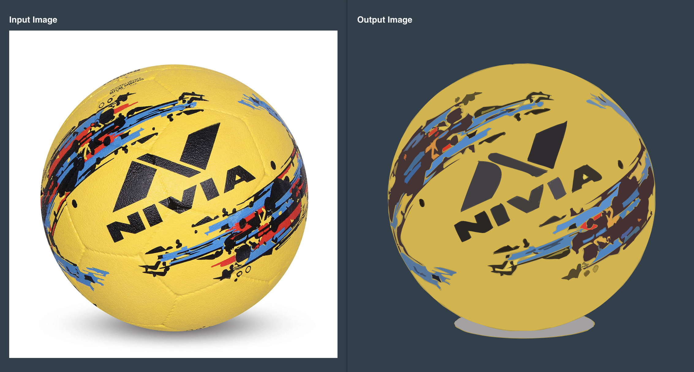

# AutoSvg
<!-- ALL-CONTRIBUTORS-BADGE:START - Do not remove or modify this section -->
[](#contributors-)
<!-- ALL-CONTRIBUTORS-BADGE:END -->

Autosvg is tracing tool, which can convert image format like (jpg,png,gif) into vector svg.
You can check your result here (Live Demo)[https://autosvg.now.sh]. 

### Results

#### Clipart tracing

#### Logo tracing

#### Image tracing


### Building AutoSVG-WASM.js

#### Prerequisite

- cmake, boost,  python

- MacOS
```bash
> brew install cmake boost
```

#### Automatic Setup 
```bash
> git submodule update --init

> sh build.sh
```

#### Manual Setup 
```bash
#
# https://github.com/emscripten-core/emsdk.git
#
export EMSDK=< path to Emscripten SDK repo>
#
# https://github.com/opencv/opencv.git
#
export OPENCV_SDK=<path to opencv repo>
#
# https://github.com/dpilger26/NumCpp.git
#
export NUMCPP=<path to numcpp repo>
``` 

- Build Emscripten 
> https://emscripten.org/docs/getting_started/downloads.html


- Build OpenCV WASM

```bash
cd $OPENCV_SDK
python ./platforms/js/build_js.py build_wasm --build_wasm
cd ../..
```

- Run cmake building script for emscripten tool chain via 
```bash
> cmake -DCMAKE_TOOLCHAIN_FILE=${EMSDK}/upstream/emscripten/cmake/Modules/Platform/Emscripten.cmake
```   
- Run make command to complile source code and building WASM file.
```bash
> make
Scanning dependencies of target autosvg-wasm
[ 25%] Building CXX object CMakeFiles/autosvg-wasm.dir/src/cpp/AutosvgWASM.cpp.o
[ 50%] Building CXX object CMakeFiles/autosvg-wasm.dir/src/cpp/core/Operations.cpp.o
[ 75%] Building CXX object CMakeFiles/autosvg-wasm.dir/src/cpp/utils/CurveUtils.cpp.o
[100%] Linking CXX executable autosvg-wasm.js
[100%] Built target autosvg-wasm 
```
- Copy wasm files to ui-app public folder. 
```bash
cp autosvg-wasm.* src/autosvg_ui/public
```

### Running AutoSVG-UI
```bash
> cd src/autosvg_ui/ && npm install
> npm run start 
```


## Contributors ✨

Thanks goes to these wonderful people ([emoji key](https://allcontributors.org/docs/en/emoji-key)):

<!-- ALL-CONTRIBUTORS-LIST:START - Do not remove or modify this section -->
<!-- prettier-ignore-start -->
<!-- markdownlint-disable -->
<table>
  <tr>
    <td align="center"><a href="http://www.cwithabhas.com"><br /><sub><b>Abhas Tandon</b></sub></a><br /><a href="https://github.com/anuj-kosambi/autosvg/commits?author=abhas9" title="Code">💻</a></td>
  </tr>
</table>

<!-- markdownlint-enable -->
<!-- prettier-ignore-end -->
<!-- ALL-CONTRIBUTORS-LIST:END -->

This project follows the [all-contributors](https://github.com/all-contributors/all-contributors) specification. Contributions of any kind welcome!
